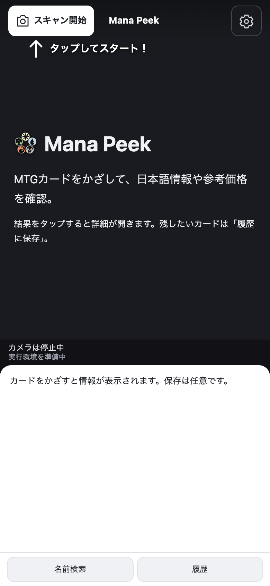
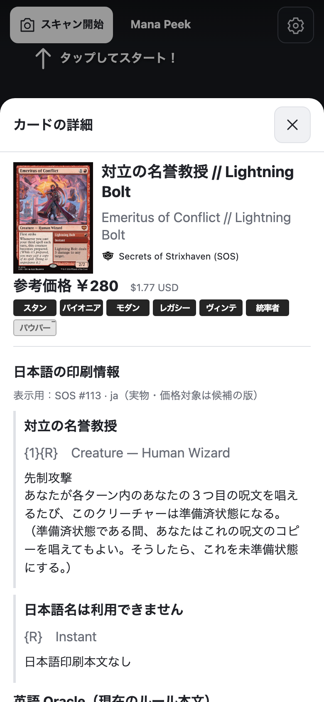
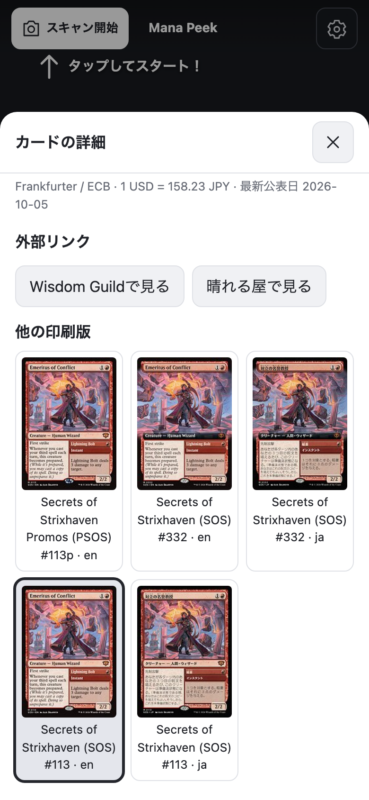

# Mana Peek 🔍

MTG（Magic: The Gathering）カードにスマホのカメラをかざすだけで、日本語のカード名・ルールテキスト・参考価格をすぐ確認できるカードスキャナーです。

<p align="center">
  
  
  
</p>

## できること

- 📷 **カメラをかざすだけ**：確認操作なしで、カード名、参考価格、対応フォーマットを表示します
- 🇯🇵 **日本語優先の表示**：日本語版があれば日本語名と日本語ルールテキストを表示します。なければ、英語であることを明示します
- 💰 **参考価格（USD / JPY 概算）**：Scryfall の価格情報と Frankfurter/ECB の為替レートから算出します
- 🔖 **任意保存の履歴**：気になったカードだけ「履歴に保存」します。自動保存はしません
- 🔁 **他の候補と印刷版の比較**：似ているカードを見比べたり、日本語版と英語版の別の印刷版を確認したりできます
- 🔗 **外部サイトへのリンク**：Wisdom Guild と晴れる屋の検索結果をワンタップで開けます
- ⌨️ **名前検索**：カメラが使えない場面でも、カード名から同じ情報を確認できます

## 使い方（かざす → 見る → 任意保存）

1. 「スキャン開始」をタップしてカメラを起動し、カード全体を画面に収めます
2. Mana Peek がカードを認識すると、確認操作なしで情報を表示します
3. 画像や名前をタップすると詳細シートが開きます（開いている間は表示を固定します）
4. 残したいカードだけ「履歴に保存」します

## 動かしてみる（開発者向け）

Node.js 24 が必要です。

```sh
npm ci
npm run dev -- --port 4187 --strictPort
```

`http://localhost:4187` を開きます。
認識モデルは、「スキャン開始」または画像選択の時点で初めてダウンロードします（モデル約 9.6 MB、辞書約 35.6 MB）。
名前検索だけならモデルのダウンロードは不要です。

カメラを使うには、HTTPS（または localhost）の secure context と、ブラウザの明示的な許可が必要です。
スマホの実機で試す場合は、HTTPS でアクセスできる環境を別途用意してください。

### テストを動かす

```sh
npm run check        # 型チェック + 単体テスト
npm run build
npm run preview -- --port 4187 --strictPort
npx playwright install chromium
npm run test:e2e     # ブラウザE2Eテスト（desktop + 390×844 mobile viewport）
```

E2E は、ビルド済みの静的ファイルを専用ポート（既定 4187、`MVP_PORT` で変更可）で配信してテストします。
そのため、実行前に `npm run build` を実行してください。
Chrome を明示する場合は `PLAYWRIGHT_CHROME_PATH` を指定します。
通常は Playwright 付属の full Chromium を使います。

サーバー待ち受けなしの mock テストも用意しています。

```sh
npm run build
PLAYWRIGHT_NO_SERVER=1 npm run test:e2e
```

### 実モデルと実 API での再現確認

```sh
npm run assets:prepare
npm run dev -- --port 4187 --strictPort
```

`http://localhost:4187/?localAssets` を開くと、ローカルにダウンロード済みの認識モデルと辞書資源を使って動作確認できます（サイズと SHA-256 を検証します）。
モデル、辞書、カード画像自体はリポジトリに含まれません（`public/recognition/assets/` と `public/recognition/vendor/` は git 管理外）。

```sh
npm run evidence:live
```

このコマンドは、実ブラウザでの画像認識から検索、価格、為替の取得までを通しで確認し、結果を `artifacts/live/<label>/` に保存します。

## 利用上の注意点

- **認識は候補です**。実物の版、言語、加工（Foil など）は、画面の表示と照合してください。実物写真、特殊枠、反射などでの精度は未検証です。
- 「他の候補」は、認識エンジンが返す上位候補（最大 5 件）のうち、Scryfall で実在を確認できたものだけを表示します。
- 日本語の**印刷本文**と英語の **Oracle 本文**は別に表示します。両面カードで片方の面だけ未翻訳の場合は、翻訳済みの面のみ日本語で表示します（英語を日本語と偽ることはありません）。
- 他の印刷版の一覧は、日本語版と英語版のみに絞り込みます。
- 価格は、選択した印刷版と加工の USD 欄から算出します。日本語版の USD 価格が欠けていても、英語版の USD 価格へ自動で置き換えることはありません。JPY 概算に固定レートは使っていません（為替の取得に失敗した場合は USD のみ表示します）。
- Scryfall API のレート制限を守る間隔でリクエストします（検索系は 510 ms 以上、その他は 110 ms 以上の間隔、429 応答後は 30 秒以上待機）。
- 画像と特徴量は外部へ送信しません。
  アカウント機能とアクセス解析は提供していません。
  通信先は、モデル配信元、Scryfall、Frankfurter に限ります。Scryfall にはカード検索語を、Frankfurter には為替ペアを送ります。
- ダーク/ライト表示は OS の設定に追従します。

## ライセンス

本リポジトリ全体を **[AGPL-3.0-or-later](LICENSE)** でライセンスしています。

組み込んでいる認識エンジン（CollectorVision）と認識モデル（Cornelius、Milo）が AGPL-3.0 のため、ネットワーク経由で利用可能にする場合は、利用者へ Corresponding Source を提供する義務があります。
本リポジトリを公開することで、この義務を満たしています。
出典と各ライブラリの条件の詳細は [`public/recognition/THIRD-PARTY-NOTICES.md`](public/recognition/THIRD-PARTY-NOTICES.md) に記載しています。

カード画像は Scryfall（`cards.scryfall.io`）から直接表示しており、独自の再配布も保存もしていません。
カードデータと画像自体の再配布権は、Scryfall / Wizards of the Coast の利用条件に従います。

Magic: The Gathering と、そのカード名、テキスト、トレードマークは、Wizards of the Coast LLC の所有物です。
本プロジェクトは Wizards of the Coast と提携しておらず、公認も受けていません。
